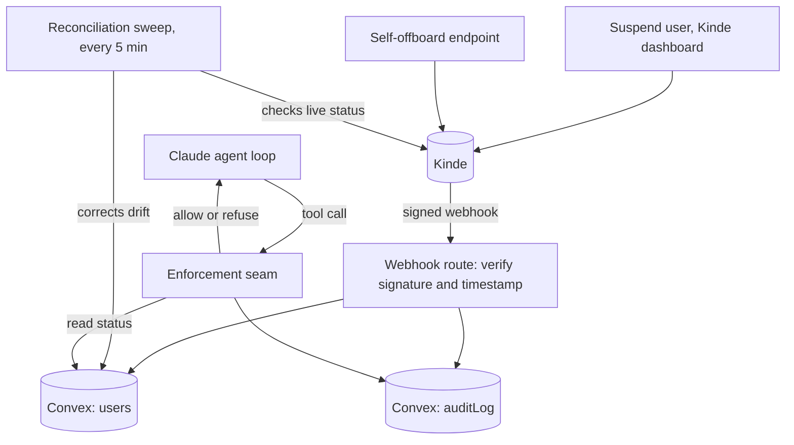

# offboarding-revocation-demo

An AI agent that acts with a human's identity has to stop within one action once that human is offboarded. This repo proves it, against real infrastructure: a real Kinde webhook, a real Convex database, a real Claude agent loop. Nothing here is mocked.

## The problem

Kinde suspending or deleting a user does not revoke a token Kinde already issued. An agent holding that token can keep calling tools after its user is gone, until the token expires on its own. This repo measures that gap, then closes it with a webhook plus a live status check on every agent action.

## How it works



1. A user signs in through Kinde. The app stores an encrypted session cookie and a Convex record for that user, status active.
2. The user gives the agent a task. Claude runs a multi-step tool-calling loop over a closed set of three actions: `list_resources`, `read_resource`, `write_resource`.
3. Before each tool call runs, it passes through one enforcement seam, `enforceToolCall`. In enforced mode, the seam reads the user's current status from Convex and allows only a confirmed active user. An offboarded status, or a status it could not resolve, both refuse. In naive mode the seam still reads that status but never acts on it: every call is allowed. Naive mode is the vulnerability, reproduced on purpose.
4. When Kinde suspends the user, from the dashboard or through this app's own self-offboard control, Kinde sends a signed webhook. The receiver verifies the signature and the event's timestamp, then marks the user offboarded in Convex. The effect applies before the delivery gets recorded, so a retried webhook can never see a duplicate and skip the effect.
5. A reconciliation sweep runs every 5 minutes as a backstop, checking each active user's live status directly in Kinde, in case a webhook is missed or delayed.

Every seam decision and every webhook event gets audited under a correlation id, so one run's full timeline is traceable end to end.

## Setup

Needs:
- A Kinde business, with a back-end web app for sign-in and an M2M app for the Management API (scopes `update:users` and `read:users`)
- A Convex deployment
- An Anthropic API key
- A tunnel (ngrok or similar), so Kinde can reach your local webhook endpoint

Steps:
1. `npm install`
2. `npx convex dev`: creates a Convex deployment if you don't have one yet, and generates `convex/_generated`
3. Copy `.env.example` to `.env.local` and fill it in from your Kinde and Anthropic dashboards
4. Set the same three Kinde values as Convex deployment env vars too. The reconciliation sweep runs on Convex's own infrastructure, which never reads `.env.local`:
   ```
   npx convex env set KINDE_ISSUER_URL <value>
   npx convex env set KINDE_M2M_CLIENT_ID <value>
   npx convex env set KINDE_M2M_CLIENT_SECRET <value>
   ```
5. Point your tunnel at `localhost:3000`, and register `<tunnel-url>/api/webhooks/kinde` in Kinde for the `user.updated` and `user.deleted` events
6. `npm run dev`

## Running it

- `npm test`: unit tests, Vitest
- `npm run lint`: ESLint
- `npm run e2e`: the end-to-end script below. Needs `npm run dev` and `npx convex dev` already running, and `E2E_KINDE_USER_ID` set to a real test user

## The proof

`scripts/e2e-narrative.ts` runs the same task against one real Kinde test user twice, once per mode, suspending the user for real partway through both runs:

| | naive | enforced |
|---|---|---|
| actions allowed after offboarding | 2 | 0 |
| where the run stopped | it didn't: ran to completion | step 2, reason `user_offboarded` |

Numbers below are measured across this build's live runs, not estimates:
- Webhook delivery latency: 652ms to 2058ms, across suspend, restore, and delete events.
- The enforcement check itself is one indexed Convex read, effectively instant next to webhook delivery.
- An access token issued before offboarding stayed valid in every test here. Kinde does not revoke an already-issued token when a user is suspended, so naive mode's real exposure window is whatever's left of that token's own lifetime, not the webhook latency above.

## Limitations

- The token-still-valid gap above is real, and this repo does not close it by revoking the token. It closes it by checking the user's live status on every call instead.
- The reconciliation sweep is a backstop for a missed or delayed webhook, on a 5-minute cycle. It is not the primary path; the webhook is.
- `runs.timeline`, `runs.get`, and `audit.byCorrelationId` are unauthenticated Convex queries. A run id or correlation id is enough to read that run's timeline. Fine for this demo's single-user console, not for a real deployment.
- The action registry covers three read and write actions on a toy resource. It proves the enforcement pattern, not a production authorization model.

## Stack

Next.js (App Router), TypeScript, Convex, Claude (Messages API), Kinde (sign-in, M2M, webhooks), Vitest.
